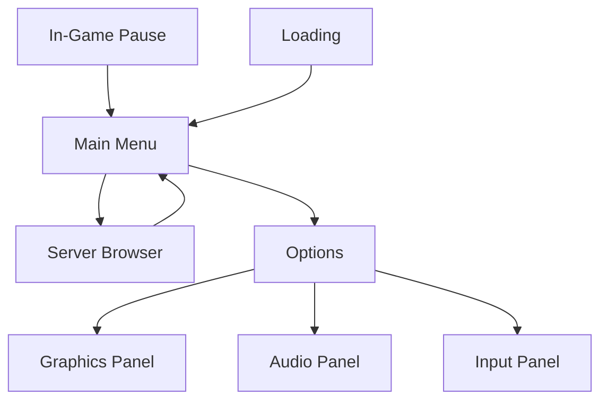
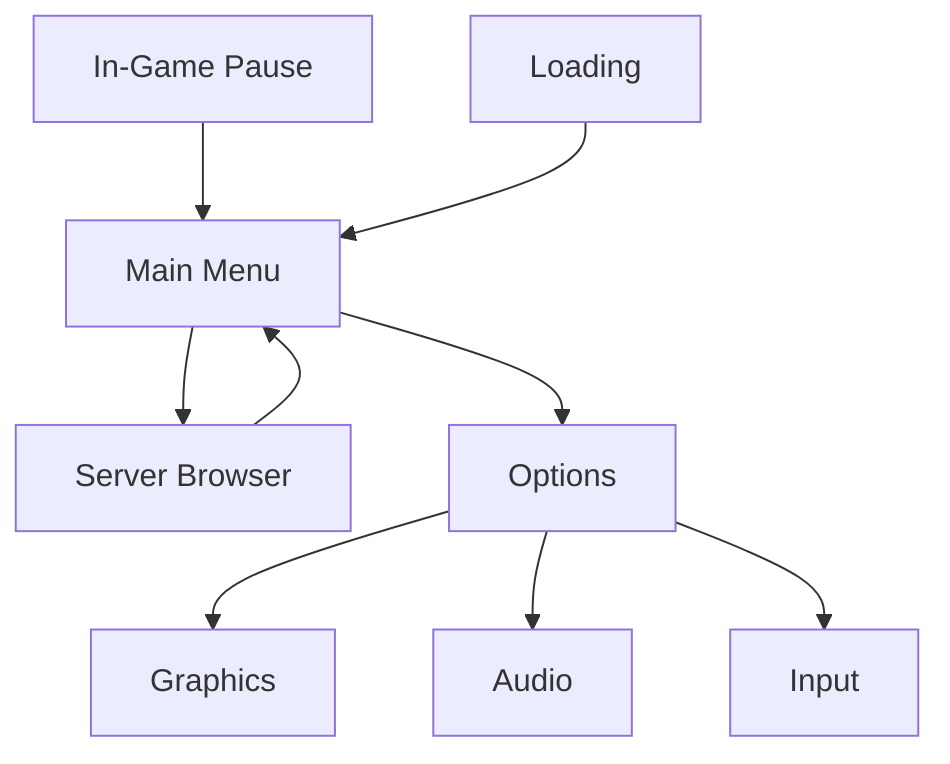

Plan: Source-like menu UX in Godot with two skins

Objective
- Build a skin-agnostic flow engine (MenuManager) that coordinates transitions
- Implement two distinct UX skins (Skin A HL-like, Skin B Portal/Left4Dead-like)
- Provide runtime skin switching

Core approach
- Use two shared primitives: BaseMenuContainer and MenuManager
- Use Screen base interface via signals
- Each screen emits transitions: to_server_browser, to_options, to_pause, return_to_main

Source-derived flows (two skins)
- Skin A HL-like: left rail navigation, content pane, keyboard focus
- Skin B Portal/Left4Dead-like: full-width panels, big action buttons, modern feel

Shared components
- MenuManager.gd autoload
- BaseMenuContainer.tscn
- Screen.gd interface with signals

Skeleton screens
- MainMenu
- ServerBrowser
- OptionsMenu (Graphics/Audio/Input as subpanels)
- PauseMenu
- LoadingOverlay

Skin A specifics
- Left rail: sections: Main, Server, Options, Exit
- Content pane shows active screen
- Focus navigation for keyboard

Skin B specifics
- Center content with large buttons
- Optional right-hand panel for hints
- Smooth transitions and focus rings

Runtime skin switching
- SkinConfig or SkinProfile resource
- MenuManager.set_skin("HL") or set_skin("Portal")
- Ensure both skins share same Screen interfaces

File map and references
- Core UI: Lobby and templates via existing UI
- Settings: addons/modular-settings-menu
- Lobby patterns: [`scripts/ui/LobbyMenu.gd`](scripts/ui/LobbyMenu.gd:1) and [`scenes/lobby.tscn`](scenes/lobby.tscn:1)
- Current plan draft and diagrams

Mermaid diagrams
- Skin A flow

- Skin B flow

 
Implementation plan (phases)
- Phase 1: Skeleton flow with Skin A
- Phase 2: Skin B skeleton and runtime switch
- Phase 3: Polish: transitions, focus, accessibility

Next steps
- Confirm plan, then encode to-dos with update_todo_list
- Or draft plan.md and proceed

References
- Lobby UI sources
- [`scripts/ui/LobbyMenu.gd`](scripts/ui/LobbyMenu.gd:1) and [`scenes/lobby.tscn`](scenes/lobby.tscn:1)
Plan: Source-like menu UX in Godot with two skins (summary)

Objective
- Build a skin-agnostic flow engine (MenuManager) that coordinates transitions
- Implement two distinct UX skins (Skin A HL-like flow, Skin B Portal/Left4Dead-like flow)
- Provide runtime skin switching

Core approach
- Shared primitives: BaseMenuContainer and MenuManager
- Screen base interface with signals for transitions (to_server_browser, to_options, to_pause, return_to_main)
- Skeleton screens to validate flow:
  - MainMenu
  - ServerBrowser (mock data)
  - OptionsMenu (Graphics/Audio/Input)
  - PauseMenu
  - LoadingOverlay
- Skin-specific layout patterns:
  - Skin A HL-like: left rail or vertical stack with a content pane
  - Skin B Portal/Left4Dead-like: full-width panels with large actions and optional right hints
- Skin switching
  - Runtime API to swap skins without changing core flow
- Reuse and references
  - Lobby UI patterns and scenes: [`scripts/ui/LobbyMenu.gd`](scripts/ui/LobbyMenu.gd:1) and [`scenes/lobby.tscn`](scenes/lobby.tscn:1)
  - Source SDK UX references for flow anchors: 
    - [`sourcesdk_reference/source-sdk-2013/src/common/ServerBrowser/IServerBrowser.h`](sourcesdk_reference/source-sdk-2013/src/common/ServerBrowser/IServerBrowser.h:1)
    - [`sourcesdk_reference/source-sdk-2013/src/common/ServerBrowser/blacklisted_server_manager.h`](sourcesdk_reference/source-sdk-2013/src/common/ServerBrowser/blacklisted_server_manager.h:1)

Two UX flows derived from Source SDK references
- Flow A (HL-like HL2/CS-style)
  - Start at Main Menu with Find Server, Settings, and Quit
  - Choose Find Server to open Server Browser panel
  - Server Browser lists servers, supports JoinGame, OpenGameInfoDialog, and filtering
  - From Server Browser, returning to Main Menu or joining a server transitions to gameplay
  - Settings accessible from Main Menu, with host-only options logically separated (matching Source’s modular UI approach)
  - Optional in-lobby chat and host/server info flows can be represented as overlays or side panels
  - Data patterns reference: IServerBrowser interface for activation/join/info, blacklisted server management for filtering logic

- Flow B (Portal2/Left4Dead/AlienSwarm-style)
  - Start at Main Menu with prominent large tiles or panes for core actions
  - Server Browser presented as a full-panel view or slide-in panel with richer, pane-based navigation
  - Settings presented as a modular set of panels (Graphics/Audio/Input) within the same screen
  - Transitions emphasize fluid, card-like animations and focus rings for gamepad/keyboard navigation
  - Subflows for different settings panels mirror Source’s modular UI but keep content within a unified skin

References from Source SDK for UI and server flow
- IServerBrowser interface hints available actions and lifecycle for server browser windows:
  - Activate, JoinGame, OpenGameInfoDialog, CloseGameInfoDialog, etc.
  - These map to flow transitions in Godot (open server browser, show server details, join)
  - Link: [`sourcesdk_reference/source-sdk-2013/src/common/ServerBrowser/IServerBrowser.h`](sourcesdk_reference/source-sdk-2013/src/common/ServerBrowser/IServerBrowser.h:1)
- Blacklist manager demonstrates server filtering layers and persistence:
  - LoadFromFile, SaveToFile, AddServer, RemoveServer, etc.
  - These map to how a UI can filter and persist blacklisted servers in the Server Browser
  - Link: [`sourcesdk_reference/source-sdk-2013/src/common/ServerBrowser/blacklisted_server_manager.h`](sourcesdk_reference/source-sdk-2013/src/common/ServerBrowser/blacklisted_server_manager.h:1)

Plan to move forward
- Option A: Encode this plan into a formal todo list (update_todo_list) to enable automated skin builds
- Option B: Draft plan.md with deeper architectural notes and two-skin blueprint
- Option C: Start Skeleton Skin A implementation wired to MenuManager, using LobbyMenu.gd and lobby.tscn as reference

Next step
- Please confirm which path you want:
  - encode to-dos now (update_todo_list)
  - draft a deeper architecture plan (plan.md extension)
  - begin Skeleton Skin A implementation

References to review if needed
- plan.md plan reference and Mermaid diagrams: plan.md
- In-project UI patterns: [`scripts/ui/LobbyMenu.gd`](scripts/ui/LobbyMenu.gd:1) and [`scenes/lobby.tscn`](scenes/lobby.tscn:1)
- Source SDK UX anchors: [`IServerBrowser.h`](sourcesdk_reference/source-sdk-2013/src/common/ServerBrowser/IServerBrowser.h:1), [`blacklisted_server_manager.h`](sourcesdk_reference/source-sdk-2013/src/common/ServerBrowser/blacklisted_server_manager.h:1)
Plan: Expanded architecture for skin-agnostic two-skin UX in Godot

Objective
- Build a skin-agnostic flow engine (MenuManager) that coordinates transitions
- Implement two distinct UX skins (Skin A HL-like flow, Skin B Portal/Left4Dead-like flow)
- Provide runtime skin switching

Core architecture
- Shared primitives:
  - BaseMenuContainer: reusable frame around content with header, content area, and footer actions
  - MenuManager.gd: autoload singleton that orchestrates screen transitions and input focus
  - Screen.gd: base interface for all screens exposing transition signals
- Skin API and runtime switching
  - SkinConfig / SkinProfile resource to define layout decisions, color themes, and typography
  - MenuManager.set_skin(name) to switch skins at runtime without changing flow
  - Screens remain skin-agnostic and communicate via Screen signals; skins swap visuals only
- Data models (core domain)
  - Server data model (mocked for now): id, name, map, players, ping
  - Game settings model: game_mode, score_limit, time_limit, map_index
  - Blacklist/filters model (mapped conceptually from Source) for server filtering
  - Theme data model: primary_color, secondary_color, font_family, spacing
- Screens (skeletons for rapid validation)
  - MainMenuScreen: entry point, routes to Server Browser and Options
  - ServerBrowserScreen: mock server list, Connect/Join actions, simple filters
  - OptionsScreen: subpanels GraphicsPanel, AudioPanel, InputPanel
  - PauseScreen: resume, options, quit
  - LoadingOverlay: progress indicator and transition fades
- Skin A HL-like layout specifics
  - Left rail navigation with a content pane on the right
  - Clear focus order for keyboard navigation; typical HL2-like spacing and typography
- Skin B Portal/Left4Dead-like layout specifics
  - Centered content with large tiles/CTAs
  - Optional right-hand hints panel; fluid transitions and card-like panels
- Reuse and references
  - Lobby UI patterns and scenes as starting points: [`scripts/ui/LobbyMenu.gd`](scripts/ui/LobbyMenu.gd:1) and [`scenes/lobby.tscn`](scenes/lobby.tscn:1)
  - Source SDK UX anchors for flow logic and server browser concepts: 
    - [`IServerBrowser.h`](sourcesdk_reference/source-sdk-2013/src/common/ServerBrowser/IServerBrowser.h:1)
    - [`blacklisted_server_manager.h`](sourcesdk_reference/source-sdk-2013/src/common/ServerBrowser/blacklisted_server_manager.h:1)

Two UX flows derived from Source SDK references
- Flow A (HL-like HL2/CS-style)
  - Main Menu -> Server Browser (Find Server) -> Server selection/Join
  - Open Settings from Main Menu; host/system-level options separated from client flow
  - Server list supports mock filtering and joining flows
- Flow B (Portal2/Left4Dead/Alien Swarm-style)
  - Main Menu with large, prominent actions
  - Server Browser as a full-panel or slide-in pane with richer navigation
  - Options presented as modular panels within the same screen
  - Transitions emphasize modern UI polish and gamepad-friendly focus

Component specs and data models
- MenuManager (Singleton)
  - Responsibilities:
    - Track current_skin, current_screen, and active transitions
    - Dispatch signals to transition between screens
    - Manage focus routing and input hints per skin
  - API:
    - set_skin(name: String)
    - go_to(screen_name: String)
    - open_subpanel(panel_name: String) for nested options
- BaseMenuContainer (Scene)
  - Common frame for all screens
  - Slots for header, content, and footer actions
  - Optional left rail (Skin A) or right hints panel (Skin B)
- Screen interface (GDScript)
  - Signals: to_server_browser, to_options, to_pause, return_to_main
  - Methods: enter_screen(), exit_screen(), focus_first_control()
- Skin A primitives
  - Left rail widget group: HL-like navigation items
  - Content pane will host current screen content
  - Focus management utilities for keyboard navigation
- Skin B primitives
  - Card-based panels; large action buttons
  - Optional right-side hints/auxiliary panel
  - Fluid transitions with subtle animations
- Data models
  - MockServer struct: id, name, map, players, ping
  - GameSettings struct: game_mode, score_limit, time_limit, map_index
  - Theme struct: color, typography, spacing
  - SkinConfig: name, layout_flags, font, colors
- Plan for two skins as separate assets
  - SkinA_MainMenu, SkinA_ServerBrowser, SkinA_Options, SkinA_Pause
  - SkinB_MainMenu, SkinB_ServerBrowser, SkinB_Options, SkinB_Pause
  - Each skin reuses MenuManager and BaseMenuContainer; only visuals and layout differ
- Mermaid diagrams
  - Combined flow with MenuManager and both skins
  mermaid
  graph TD
  MM[MenuManager] --> SkinA_Main[Skin A Main Menu]
  MM --> SkinB_Main[Skin B Main Menu]
  SkinA_Main --> SkinA_Server[Skin A Server Browser]
  SkinB_Main --> SkinB_Server[Skin B Server Browser]
  SkinA_Server --> SkinA_Main
  SkinB_Server --> SkinB_Main
  SkinA_Main --> SkinA_Options[Skin A Options]
  SkinB_Main --> SkinB_Options[Skin B Options]
  SkinA_Options --> SkinA_Graphics[Skin A Graphics]
  SkinA_Options --> SkinA_Audio[Skin A Audio]
  SkinA_Options --> SkinA_Input[Skin A Input]
  SkinB_Options --> SkinB_Graphics[Skin B Graphics]
  SkinB_Options --> SkinB_Audio[Skin B Audio]
  SkinB_Options --> SkinB_Input[Skin B Input]
  MM --> Pause[In-Game Pause]
  Pause --> SkinA_Main
  Pause --> SkinB_Main
  MM --> Loading[Loading Overlay]
  Loading --> SkinA_Main
  Loading --> SkinB_Main

Next steps in plan
- Phase 1: Expand plan with explicit file layouts and node trees for skeletons
- Phase 2: Create plan.md sections that describe interface contracts (signals, methods) and data models
- Phase 3: Start with Skeleton Skin A implementation wired to MenuManager
- Phase 4: Implement Skin B skeleton and a runtime switch mechanism
- Phase 5: Polish, accessibility, and basic tests

Notes
- We can progressively convert plan.md into a formal to-do list with update_todo_list once the architecture details are stabilized and you approve the plan expansion
- If you want, I can insert concrete code skeletons as comments in plan.md to guide future implementations, referencing existing UI patterns in the repo

Mermaid diagrams:
- Skin A flow diagram (HL-like)

- Skin B flow diagram (Portal/Left4Dead-like)

References
- Lobby patterns: [`scripts/ui/LobbyMenu.gd`](scripts/ui/LobbyMenu.gd:1) and [`scenes/lobby.tscn`](scenes/lobby.tscn:1)
- Source SDK server browser concepts: [`IServerBrowser.h`](sourcesdk_reference/source-sdk-2013/src/common/ServerBrowser/IServerBrowser.h:1) and [`blacklisted_server_manager.h`](sourcesdk_reference/source-sdk-2013/src/common/ServerBrowser/blacklisted_server_manager.h:1)